# Entity Relationship Diagram (ERD)

This document maps the data structures of the three siloed source systems and how they relate to the final unified Golden Customer Record.

## Schema Visualization

```mermaid
erDiagram
    CORE_BANKING {
        string Acct_Num PK
        string Cust_Name
        string Email
        string DOB
        float Account_Balance
    }
    
    CREDIT_CARD {
        string Card_ID PK
        string Full_Name
        string Phone_Num
        string SSN "Unformatted"
        float Credit_Limit
    }
    
    MORTGAGE {
        string Loan_ID PK
        string First_Name
        string Last_Name
        string SSN "Formatted with dashes"
        string Contact_Number
    }
    
    GOLDEN_RECORD {
        string Golden_ID PK "UUID"
        string Legal_Name "Normalized Title Case"
        string National_ID "Normalized SSN (No dashes)"
        string Master_Email
        string Master_Phone "E.164 Format"
        string Active_Products "Array of product types"
        float Total_Exposure "Sum of balances/limits"
    }

    CORE_BANKING }|--|| GOLDEN_RECORD : "Transforms & Merges into"
    CREDIT_CARD }|--|| GOLDEN_RECORD : "Transforms & Merges into"
    MORTGAGE }|--|| GOLDEN_RECORD : "Transforms & Merges into"
```

## Data Mapping Rules
* **Primary Key Resolution:** If `SSN` exists across systems (even if formatted differently), it acts as the primary deterministic match.
* **Fallback Resolution (Fuzzy):** If `SSN` is missing, records are linked using a combination of `Name` (via Levenshtein distance) + `Email` or `Phone`.
* **Aggregation:** Financial metrics (`Account_Balance`, `Credit_Limit`) and product types are aggregated into `Total_Exposure` and `Active_Products` lists within the Golden Record.